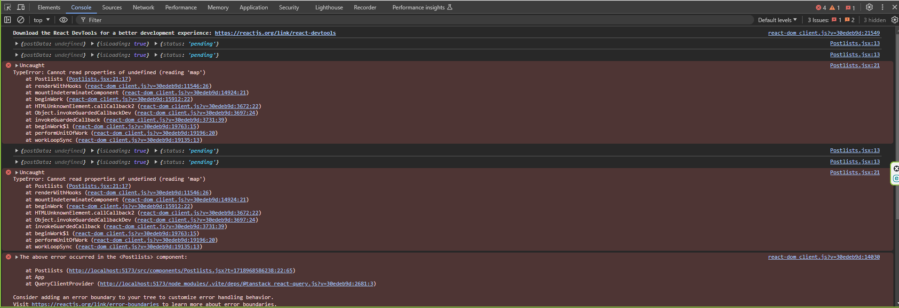

### Bug Report : 10:55 / 39:41 - Cannot read properties of undefined (reading 'map')     Postlists.jsx:21 Uncaught  

**Title**: Data is appearing on the page.

**Description**: When i mapping postData which is coming from fetchposts then this error is occuring.

**Expected Behavior**:
All 30 data should be appeared successfully on the page.

**Actual Behavior**:
`Cannot read properties of undefined (reading 'map')     Postlists.jsx:21 Uncaught `.

**Steps to Reproduce**:
1. Go to the contact page.
2. Fill in the form fields.
3. Click on the "Submit" button.

**Screenshots/Logs**:
